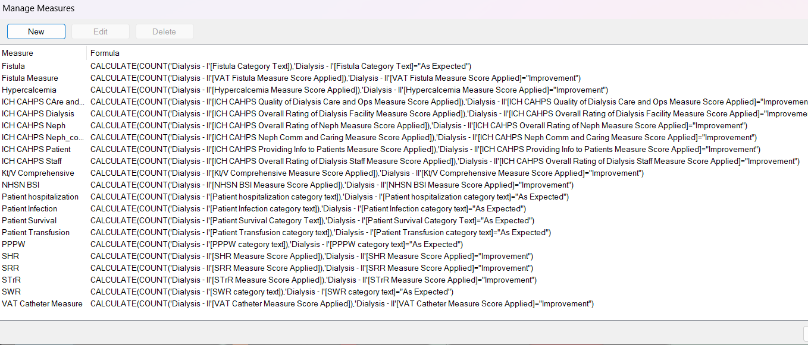
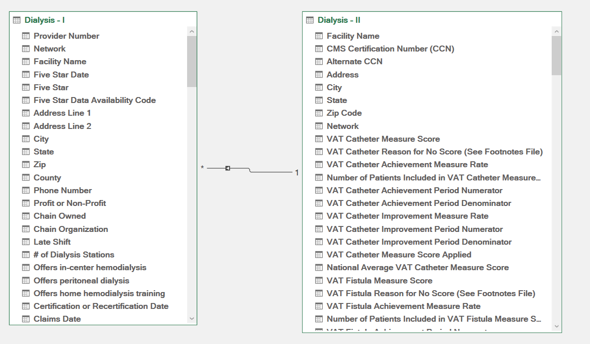
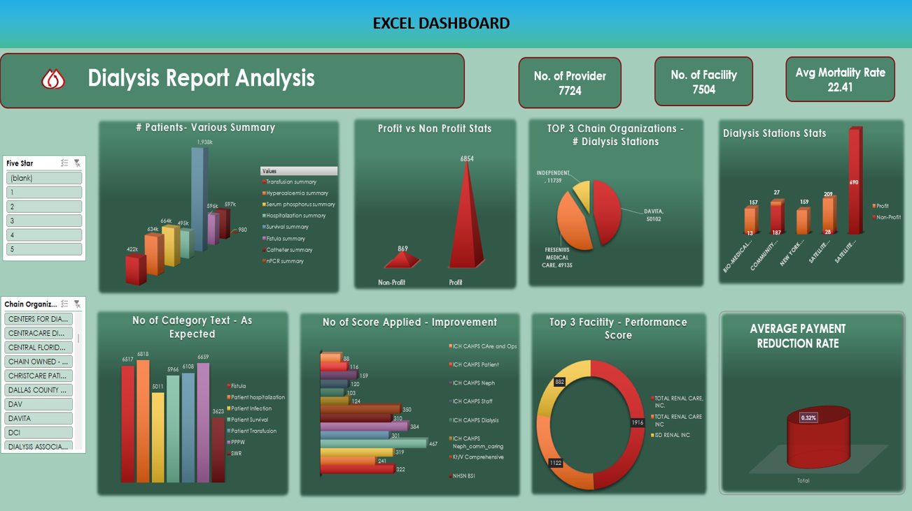

# HealthCare Dialysis Analysis

## Introduction :
This is an EXCEL Project on "HealthCare Dialysis Analysis". The project is to analyze and derive insights to answer crucial 
questions and help the healthcare provider to provide better and timely treatment for the patient.

### SKills Used:
- Power Pivot
- Pivot Table
- Calcualted Field
- Data Model in Power Pivot

### Problem Statement

1. Number of Patients across various summaries

2. Profit Vs Non-Profit Stats

3. Top 3 Chain Organizations in terms of no. of dialysis stations

4. Dialysis Stations Stats

5. No of Category Text  - As Expected

6. No of Score Applied – Improvement

7. Top 3 Facilities in terms of Total Performance Score

8. Average Payment Reduction Rate

## Calcualted Field

## Data Model

## DASHBOARD

