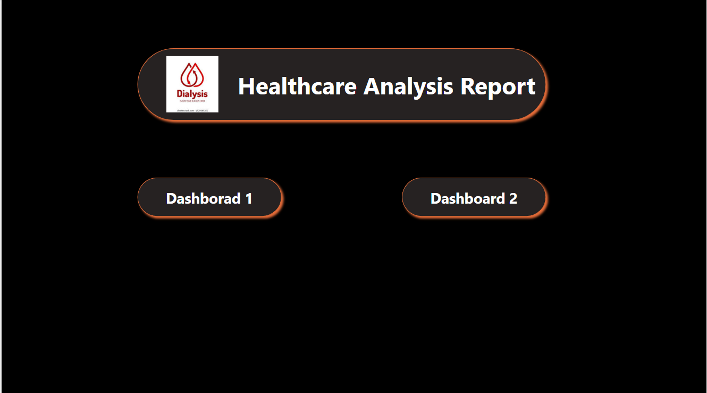
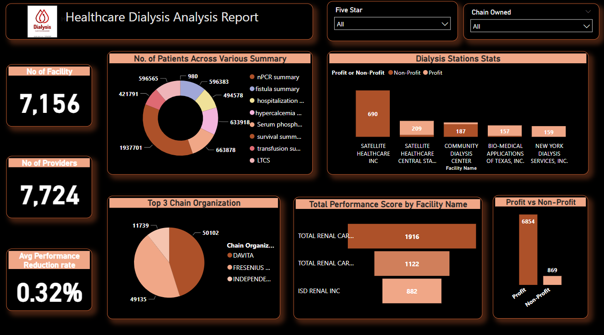
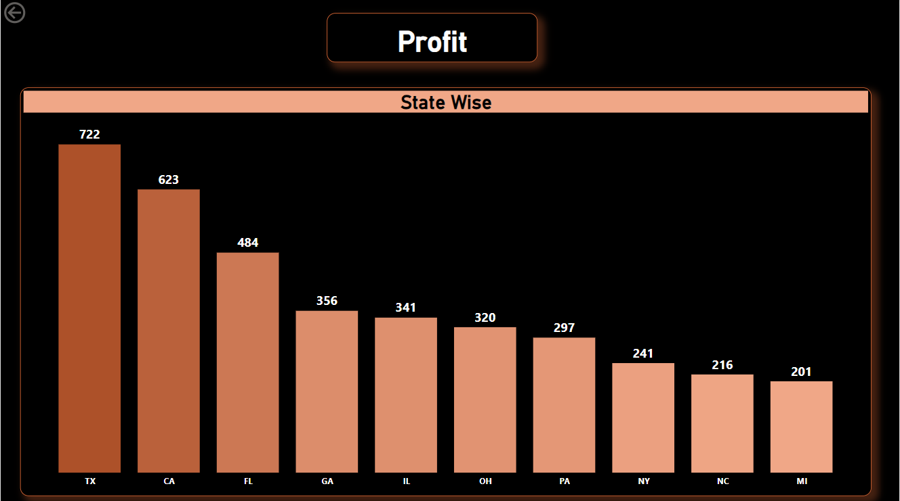
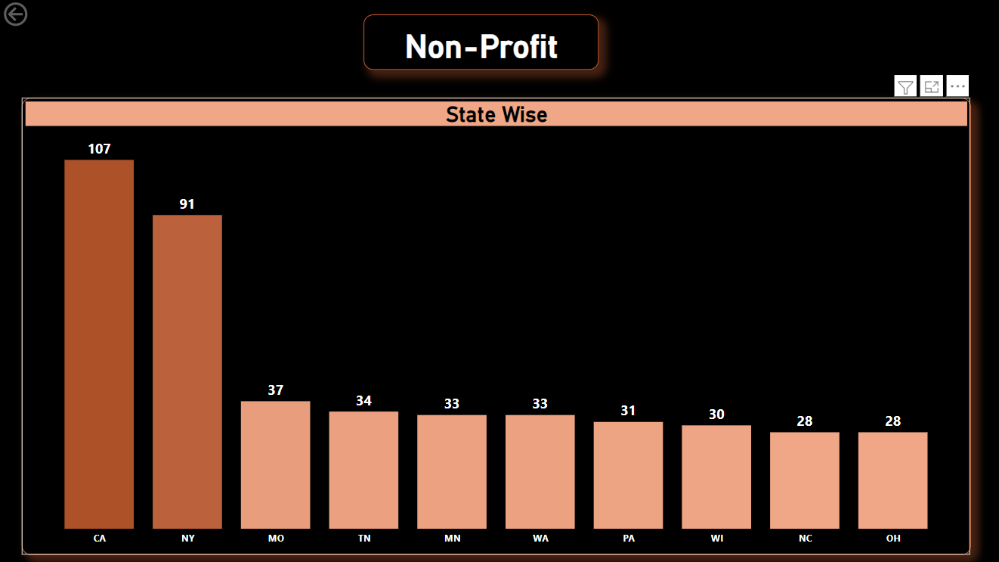
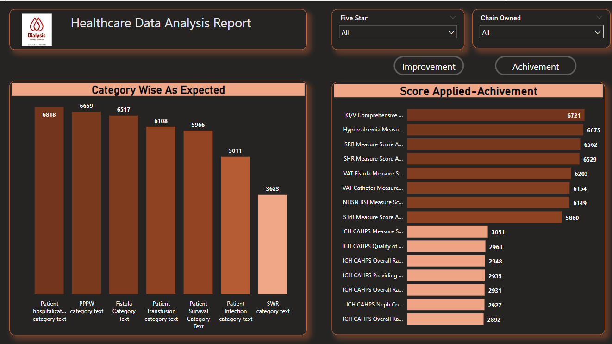

# HealthCare Dialysis Analysis

## Introduction :
This is a power Bi Project on HealthCare Dialysis. The project is to analyze and derive insights to answer crucial 
questions and help the healthcare provider to provide better and timely treatment to the patient.

### Data Set : 2 Data Sets Provided

### Problem Statement
1. Number of Patients across various summaries

2. Profit Vs Non-Profit Stats

3. Top 3 Chain Organizations in terms of no. of dialysis stations

4. Dialysis Stations Stats

5. No of Category Text  - As Expected

6. No of Score Applied – Improvement

7. Top 3 Facilities in terms of Total Performance Score

8. Average Payment Reduction Rate

### Skills Used :
The following Power Bi features were incorporated:

- Power Query For ETL process : Removed duplicates, Imputed Null Values with meaning data, Checked Data Types
- Data Modelling : Challenge based with many to many relationship overcome with creating Bridge Table
- DAX function used
- Drill Through used to navinagate Detailed report
- Drill down and drill up used
- Bookmark and selection used
- Slicer and Fillters used.
- Buttons and Page Navigation : used to access various reports
- 
## Data Modelling:

## DashBoard: 
#### Main Dashboard

#### Dashboard 1

When clicking Profit/Non_Profit in Bar Chart in Dashboard1 its navigated to Profit/Non_Profit based on the selection through Drill-through.
      
 Profit                                          |                  Non_Profit
:-----------------------------------------------:|:----------------------------------------------:
                          |  

#### Dashboard 2

